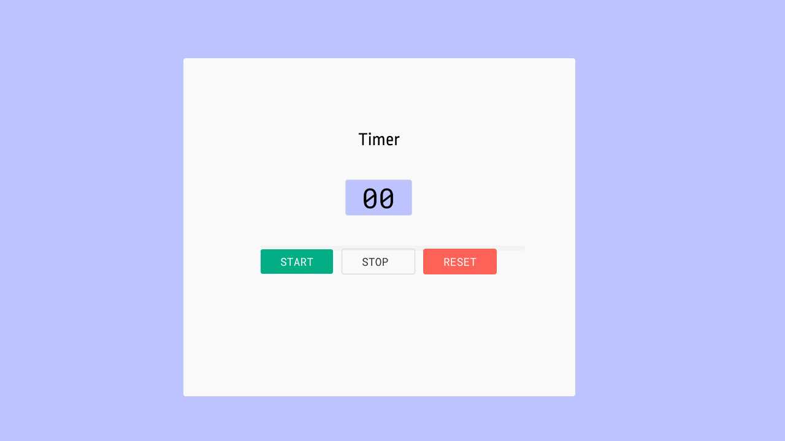

# Frontend Lab - Timer App

## Welcome! 👋

Thanks for checking out this frontend assessment.

[Frontend Lab](https://www.frontendlab.io) assessments help you sharpen your coding skills through real-world projects, making it easier to succeed in frontend assessments or machine coding rounds.

**To do this challenge, you need a good understanding of React, JavaScript and CSS.**

## The challenge

Your challenge is to build a Timer App using React.

You can use any tools you like to help you complete the assessment. So, if you have something you'd like to practice, feel free to give it a go.

If you come across any design elements in the design file that are not specified in the requirements, you are only expected to create the UI. Developing functionality for these elements is optional.

**Requirements:**

- Start button to start the timer
- Stop button to stop the timer
- Restart button to reset the timer to 0 and start again
- When the timer is stopped, clicking start should resume it from where it was stopped

Want some support on the challenge? [Join our community](https://discord.gg/ATStc5QVdv) and ask questions in the **#help** channel.

## Where to find everything

Your task is to build the project based on the designs in the `/design` folder, where you'll find the desktop version. However, it's not mandatory to follow these designs—you can also incorporate your own design if you prefer.

The designs are provided in PNG static format, but unlike our competitors who charge for the **Figma design file**, we offer it completely **FREE** on our platform under the assessment page. Use our Figma design file at no extra cost and save time on guessing styles like `font-size`, `padding`, and `margin` etc.

## Building your project

Feel free to use any workflow that you feel comfortable with. Below is a suggested process, but do not feel like you need to follow these steps:

1. Initialize your project as a public repository on [GitHub](https://github.com/). Creating a repo will make it easier to share your code with the community if you need help. If you're not sure how to do this, [have a read-through of this Try Git resource](https://try.github.io/).
2. Configure your repository to publish your code to a web address. This will also be useful if you need some help during a challenge as you can share the URL for your project with your repo URL. There are a number of ways to do this, and we provide some recommendations below.
3. Review the designs and requirements to begin planning how you'll tackle the project.

## Deploying your project

As mentioned above, there are many ways to host your project for free. Our recommend hosts are:

- [Vercel](https://vercel.com/)
- [Netlify](https://www.netlify.com/)
- [Firebase Hosting](https://firebase.google.com/docs/hosting)

## Create a custom `README.md`

We strongly recommend overwriting this `README.md` with a custom one. A custom `README` will help you explain your project and reflect on your learnings.

It should also include installation and setup instructions.

## Submitting your solution

Submit your solution on the platform. Open this [Timer app](https://www.frontendlab.io/assessment/66b8970fba617dd0f01e842a) link and complete the form to submit your challenge.

## Evaluation Criteria

- Functionality: The application should meet all the requirements and work correctly without errors.
- UI/UX: The application should have a clean and intuitive user interface.
- Code Quality: The code should be well-organized, modular, and follow best practices.
- Documentation: The README.md file should be clear and comprehensive, providing all the necessary information to understand, install, and run the project.

## Sharing your solution

There are multiple places you can share your solution:

1. Share your live URL and GitHub repository in the **#finished-projects** channel of our [community](https://discord.gg/ATStc5QVdv).
2. Tweet [@teamfrontendlab](https://twitter.com/teamfrontendlab) and mention **@teamfrontendlab**, including the repo and live URLs in the tweet. We'd love to take a look at what you've built and help share it around.
3. Share your solution on other social channels like LinkedIn.
4. Blogging about your experience building your project is a fantastic way to reinforce what you've learned. Share your workflow, explain your technical choices, and walk through your code—these insights not only help solidify your knowledge but also provide valuable learning for others in the community. Great platforms to write on are [Medium](https://medium.com/), [dev.to](https://dev.to/), and [Hashnode](https://hashnode.com/).

## Got feedback for us?

We love receiving feedback! We're always looking to improve our assessments and our platform. So if you have anything you'd like to mention, please email teamfrontendlab@gmail.com.

This challenge is completely free. Please share it with anyone who will find it useful for practice.

**We're looking forward to seeing what you can create!** 🚀
